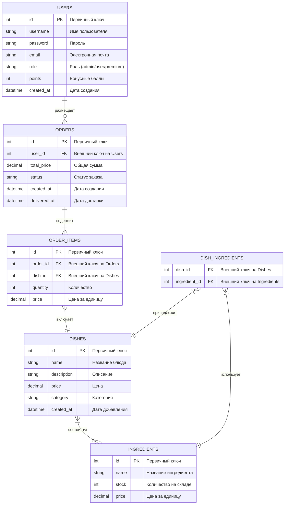

# ER-диаграмма базы данных пиццерии

## Описание связей

1. **USERS - ORDERS** (1:M)
   - Один пользователь может иметь много заказов
   - Каждый заказ принадлежит только одному пользователю

2. **ORDERS - ORDER_ITEMS** (1:M)
   - Один заказ может содержать много позиций
   - Каждая позиция принадлежит только одному заказу

3. **ORDER_ITEMS - DISHES** (M:1)
   - Одно блюдо может быть в разных позициях заказов
   - Каждая позиция заказа относится к одному блюду

4. **DISHES - INGREDIENTS** (M:M)
   - Одно блюдо может содержать много ингредиентов
   - Один ингредиент может использоваться в разных блюдах
   - Связь реализована через промежуточную таблицу DISH_INGREDIENTS

## Особенности таблиц

### USERS
- Хранит информацию о пользователях
- Поддерживает разные роли (admin/user/premium)
- Отслеживает бонусные баллы для системы скидок

### ORDERS
- Отслеживает все заказы
- Хранит статус и время доставки
- Содержит общую сумму заказа

### ORDER_ITEMS
- Детализация заказов
- Хранит количество и цену каждой позиции
- Позволяет отслеживать историю цен

### DISHES
- Каталог доступных блюд
- Категоризация блюд
- Описание и текущие цены

### INGREDIENTS
- Управление запасами ингредиентов
- Отслеживание стоимости ингредиентов
- Контроль наличия на складе
